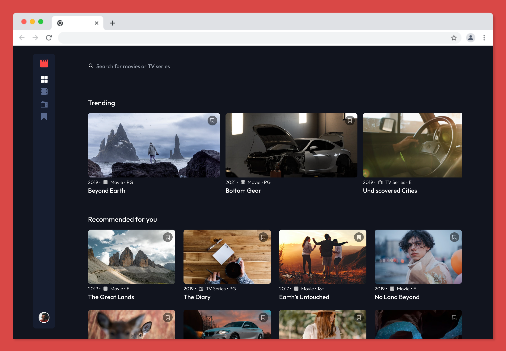

# Entertainment web app solution

While this is a solution to the [Entertainment web app challenge on Frontend Mentor](https://www.frontendmentor.io/challenges/entertainment-web-app-J-UhgAW1X) challenge and Frontend Mentor challenges help you improve your coding skills by building realistic projects, I decided to add extra functionality to create a full stack web application using Firebase.

## Table of contents

- [Overview](#overview)
  - [The challenge](#the-challenge)
  - [Screenshot](#screenshot)
  - [Links](#links)
- [My process](#my-process)
  - [Built with](#built-with)
  - [Useful resources](#useful-resources)
- [Author](#author)

## Overview

### The challenge

Users should be able to:

- View the optimal layout for the app depending on their device's screen size
- See hover states for all interactive elements on the page
- Navigate between Home, Movies, TV Series, and Bookmarked Shows pages
- Add/Remove bookmarks from all movies and TV series
- Search for relevant shows on all pages
- Login as a user to access video content pages

### Screenshot

### Links

- Solution URL: [github.com/ericnbello/entertainment-web-app](https://github.com/ericnbello/entertainment-web-app)
- Live Site URL: [streaming-web-app.firebaseapp.com/](https://streaming-web-app.firebaseapp.com/)

## My process

### Built with

- Semantic HTML5 markup
- CSS custom properties
- Flexbox
- CSS Grid
- Mobile-first workflow
- [React](https://reactjs.org/) - JS library
- [Tailwind](https://tailwindcss.com/) - CSS utility framework
- [React Router 6](https://reactrouter.com/)
- [Google Firebase](https://firebase.google.com/) - Fully managed backend infrastrucutre

### Useful resources

- [React Router 6](https://reactrouter.com/docs/en/v6/getting-started/tutorial) - This helped me become familiar with new features found in version 6. It's very thorough and I will continue to use it going forward.
- [Firebase Documentation](https://firebase.google.com/docs/reference/js/auth) - Detailed documentation regarding Firebase authentication methods, making it simple to add login functionality to webpages.

## Author

- Website - [Eric Bello](https://www.ericnbello.com)
- Frontend Mentor - [@ericnbello](https://www.frontendmentor.io/profile/ericnbello)
- Twitter - [@ericnbello](https://www.twitter.com/ericnbello)